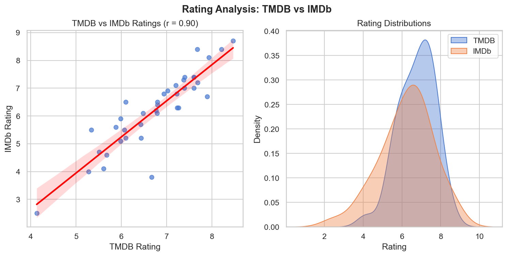
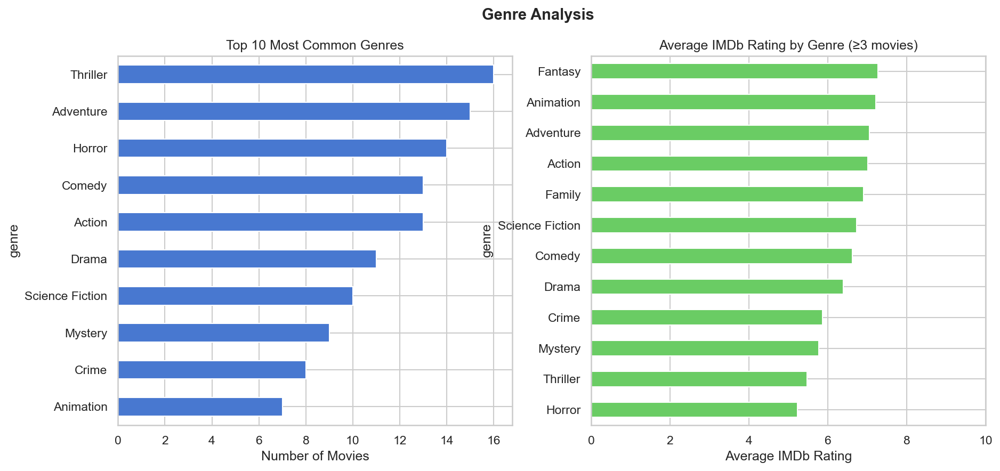
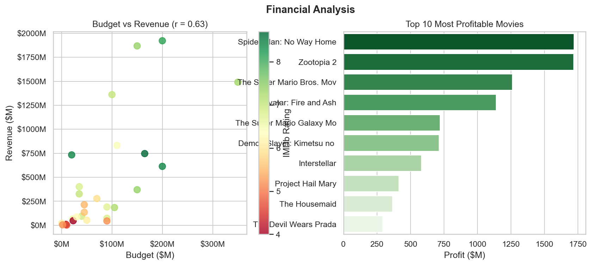
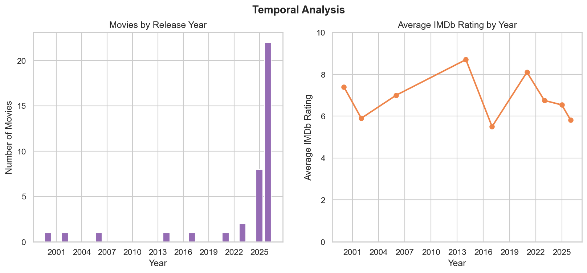

# Report — Movie Data Collection & Analysis Pipeline

**Author:** Zhixian Wang  
**Date:** April 2026

---

## 1. Data Collection Summary

| Stage | Records | Notes |
|-------|---------|-------|
| TMDB API | 50 movies | Popular movies endpoint, pages 1–3 |
| OMDb API (IMDb ratings) | 50 queries | 39 returned ratings; 11 unreleased/too new |
| Merged & cleaned | 50 rows, 21 columns | No duplicates; zero budgets nullified |

**Fields collected per movie:**  
`tmdb_id`, `imdb_id`, `title`, `release_date`, `runtime`, `genres`, `budget`, `revenue`, `tmdb_rating`, `tmdb_vote_count`, `production_companies`, `original_language`, `cast` (top 5), `crew` (top 5), `imdb_rating`, `imdb_votes`, `metascore`, `release_year`, `profit`

**Data availability:**
- IMDb ratings: 39 / 50 (78%)
- Metascores: 34 / 50 (68%)
- Budget + revenue: 29 / 50 (58%)

---

## 2. Analysis Findings

### 2.1 Rating Analysis

**TMDB ↔ IMDb correlation: r = 0.898**

The two platforms agree strongly — movies rated highly on TMDB tend to be rated highly on IMDb too. The rating distributions differ slightly: TMDB ratings cluster around 6.5–7.5 while IMDb ratings tend to be a bit lower (6.0–7.0), suggesting TMDB audiences rate more generously on average.

---

### 2.2 Genre Analysis

- **Most common genre:** Thriller, followed by Action and Drama — reflecting the blockbuster-heavy "popular movies" sample.
- **Highest-rated genre (IMDb):** Fantasy movies averaged the highest IMDb scores among genres with ≥3 representatives.
- Action and Adventure dominate frequency but sit closer to the mid-range for average ratings.

---

### 2.3 Financial Analysis

- **Budget ↔ Revenue correlation: r = 0.614** — a moderate positive relationship. Bigger budgets generally earn more, but not reliably; several high-budget films underperformed.
- **Most profitable movie:** Spider-Man: No Way Home, which earned far above its production budget.
- A cluster of mid-budget films ($50M–$100M) achieved outsized returns, suggesting efficient production spending can outperform mega-budget productions.

---

### 2.4 Temporal Analysis

- The dataset is naturally concentrated around 2024–2026, reflecting TMDB's "popular" ranking.
- **Best-rated year (avg IMDb):** 2014 — the few older classics in the dataset (e.g., Interstellar, Spider-Man: No Way Home) pull up historical years.
- Recent releases (2025–2026) have lower average ratings, partly because IMDb ratings stabilise over time as more viewers vote.

---

## 3. Interesting Insights

1. **Ratings convergence:** The 0.898 correlation between TMDB and IMDb is higher than expected given the different user bases. Both platforms appear to reflect genuine quality signals rather than platform-specific biases.

2. **The blockbuster paradox:** The highest-budget movies don't always have the highest ratings. The most profitable movies also tend to be well-rated, but mid-budget films often achieve better ROI than the mega-productions.

3. **Fantasy outperforms its frequency:** Despite being less common than Action or Thriller, Fantasy films average higher IMDb ratings — possibly because a dedicated fanbase rates more enthusiastically.

---

## 4. Challenges & Solutions

| Challenge | Solution |
|-----------|----------|
| IMDb blocked scraping via AWS WAF (HTTP 202 challenge) | Used OMDb API as a compliant fallback — same fields, official API |
| 11 movies had no IMDb rating | These are very recent/unreleased titles; kept rows, treated as missing |
| Budget/revenue missing for 21 movies (TMDB stores `0` for undisclosed) | Converted zeros to `NaN`; financial analysis limited to 29 movies with real data |
| TMDB genres returned as a list | Flattened to comma-separated strings for CSV compatibility |

---

## 5. Limitations & Future Improvements

- **Sample bias:** Dataset covers only TMDB's current "popular" list — not a representative cross-section of cinema history.
- **IMDb scraping:** Direct HTML scraping of IMDb is blocked by AWS WAF. A future implementation could use Selenium/Playwright with headless browser rendering, or stick with the OMDb API.
- **Metascore coverage:** Only 34/50 movies have a Metascore; many recent releases haven't been reviewed by enough critics yet.
- **Deeper text analysis:** Scraping and analysing user review text was out of scope but would add qualitative depth.
- **Expanding the dataset:** Re-running with `num_items=200+` across multiple genre lists would give more statistically robust findings.
